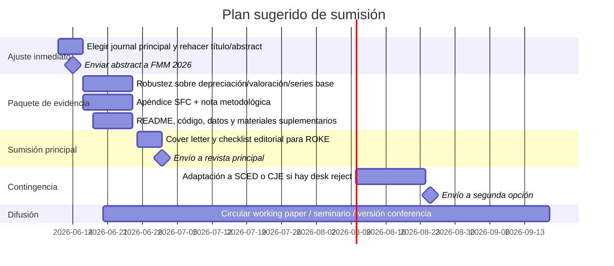

# Venues plausibles para someter tu paper

## Resumen ejecutivo

Tu repo sugiere un perfil de trabajo mucho más “journal-ready” de lo que suele verse en una etapa doctoral: hay un pipeline explícito de **scoping metodológico**, **búsqueda sistemática**, **verificación de fuentes**, **redacción estructurada**, **revisión por pares simulada**, **revisión posterior** y **harness de evaluación**; además, el ejemplo más concreto dentro del repo apunta a un tema de **macroeconomía heterodoxa** sobre **enfoques stock-flow consistent para los stocks de capital en Chile**, con mención explícita a bases chilenas, análisis de series de tiempo y modelación SFC. En otras palabras, el mejor supuesto no es “paper cualquiera de economía”, sino un manuscrito de **macroeconomía heterodoxa/política económica** con una capa fuerte de **reproducibilidad y diseño metodológico**. citeturn6view0turn9view0turn10view0turn11view0turn12view0

Bajo ese supuesto, mis tres mejores apuestas son estas. **Review of Keynesian Economics** es la mejor opción por ajuste sustantivo: el journal se presenta como foro para desarrollar ideas keynesianas y dialogar críticamente con otros paradigmas macroeconómicos. **Structural Change and Economic Dynamics** es la mejor opción si tu paper tiene tracción empírica fuerte, una historia clara de transformación estructural y resultados que importen fuera de Chile. **Cambridge Journal of Economics** es la apuesta de más prestigio intelectual, pero también la más exigente en posicionamiento heterodoxo, realismo analítico y claridad narrativa para lectores no obsesionados con la técnica por la técnica. citeturn13search0turn39search0turn18search11turn34view0

Como complemento de visibilidad, el venue de conferencia más útil **ahora mismo** es **FMM 2026**, porque sigue totalmente alineado con macro heterodoxa/pluralista y, al 11 de junio de 2026, su deadline seguía abierto hasta el **14 de junio de 2026** para abstracts; además, las decisiones se anuncian a mediados de julio. Si tu manuscrito está lo bastante maduro para un abstract de 400 palabras con pregunta, método y hallazgo, yo lo usaría para testear recepción antes o en paralelo a la sumisión a revista. citeturn25search0turn25search18

## Qué inferí de tu repo y qué supuse

La inferencia central sale de dos piezas del repo. Primero, el skill de investigación profunda y el skill de escritura muestran una preferencia marcada por: diseño metodológico explícito, búsqueda sistemática, verificación de fuentes, síntesis crítica, disclosure de IA, revisión editorial e integridad/reproducibilidad. Segundo, el workspace macroeconómico menciona de forma directa un deliverable para **“Stock-flow consistent approaches to capital stocks in Chile”**, con posibles elecciones de método como **modelación cuantitativa**, **análisis histórico**, **bases de datos chilenas** y **time-series analysis**. Eso empuja la lectura hacia un paper sustantivo de macroeconomía heterodoxa con ambición metodológica seria, no solo un ensayo conceptual. citeturn6view0turn10view0turn11view0

Con base en eso, asumí lo siguiente para evaluar plausibilidad de aceptación. El paper probablemente combina: una **pregunta de política macro o de medición macroeconómica**; una arquitectura **stock-flow consistent** o, al menos, stock-flow aware; reconstrucción o comparación de **stocks de capital**; **datos secundarios**; algún grado de **series de tiempo** o validación empírica; y un paquete de **código/datos/apéndices** mejor que el promedio. También asumí calidad de “buen borrador doctoral”, es decir, con contribución real pero todavía necesitado de una mejor calibración editorial según el target. Si el paper real fuera más bien un artículo sobre tu **software/pipeline** y no sobre macro, esta shortlist cambiaría bastante. citeturn6view0turn9view0turn10view0turn11view0

Tus fortalezas probables, mirando el repo, son cuatro: **disciplina metodológica**, **cobertura bibliográfica**, **transparencia/reproducibilidad** y **capacidad de revisión iterativa**. Tus riesgos probables ante revistas top del nicho son también cuatro: que el paper quede demasiado “herramienta metodológica” y no lo bastante “hallazgo económico”; que la contribución chilena no se traduzca claramente a debates internacionales; que el marco SFC no quede conectado con controversias vigentes; y que la parte cuantitativa aparezca demasiado técnica para journals que castigan la complejidad mal narrada. citeturn9view0turn10view0turn11view0turn18search11turn39search0

## Matriz comparativa de venues

### Revistas

> **Nota de lectura**: en la columna de métricas, marco con **\*** los valores que pude verificar solo en fuentes públicas secundarias que replican/recogen datos de Scopus/SCImago o JCR porque la página del editor no exponía el número exacto en texto accesible. En revistas, “rolling” significa que no vi una fecha general de cierre para artículos regulares; las fechas fijas suelen corresponder a números especiales.

| Revista | Scope y tipos típicos | Métricas | OA y APC | Deadline / tiempos | Audiencia | Plausibilidad para tu paper |
|---|---|---|---|---|---|---|
| **Review of Keynesian Economics** | Foro para desarrollar y difundir ideas keynesianas y fomentar intercambio crítico con otros paradigmas macro; papers teóricos y empíricos orientados al debate macro. | JIF: n/d público accesible; CiteScore 4.5 (2025)\*; SJR 0.695 (2025)\* | OA/APC no pude verificarlos con claridad en fuente oficial accesible; revisar según contrato/editorial. | Envío regular; tiempo medio no público en fuentes accesibles. | Keynesianos, post-keynesianos, macro heterodoxa. | **Muy alta** si el manuscrito está claramente anclado en debates keynesianos/SFC y no se queda en contabilidad descriptiva. |
| **Structural Change and Economic Dynamics** | Publica trabajo teórico, aplicado, histórico y metodológico sobre cambio estructural; acepta papers con técnicas econométricas/estadísticas y también teoría pura sobre dinámicas estructurales. | JIF 5.5\*; CiteScore 9.3\*; SJR 1.406\* | Tiene política OA; APC ~US$3,930\* | Rolling; tiempo medio no visible en fuente oficial accesible. | Economistas de desarrollo, cambio estructural, crecimiento, distribución, innovación. | **Alta** si conviertes el caso chileno en una historia de transformación estructural con aprendizaje más amplio. |
| **Cambridge Journal of Economics** | Journal heterodoxo y de economía política; recibe trabajo teórico, aplicado, interdisciplinario, metodológico e historia del pensamiento. Manuscritos normalmente ≤10,000 palabras; también comentarios sobre artículos publicados. | JIF 2.1 (2024); 5-year IF 2.2; CiteScore 4.6 (2025); SJR 0.848\* | Híbrida; OA opcional con APC calculado por el charge finder de OUP; monto no visible como cifra fija en el texto accesible. | Rolling; doble anonimato; filtro editorial preliminar fuerte; sin promedio público accesible. | Economía política heterodoxa internacional. | **Alta pero exigente**: gran fit intelectual, pero la barrera de desk rejection es real si el paper luce demasiado estrecho o demasiado técnico sin realismo analítico. |
| **Journal of Post Keynesian Economics** | Trabajo teórico y empírico innovador que ilumine problemas económicos contemporáneos desde tradición post-keynesiana. | JIF: n/d público accesible; CiteScore 1.5\*; SJR 0.400\* | Híbrida (Open Select); sin APC si no eliges OA; APC exacto no visible en snippet accesible del costo. | Rolling; tiempo medio no público en fuentes accesibles. | Post-keynesianos, monetarios, crecimiento/distribución, demanda efectiva. | **Alta** si enfatizas la controversia post-keynesiana específica y haces explícito el aporte frente a literatura ya existente. |
| **Review of Political Economy** | Doble anonimato; contribuciones críticas y constructivas en todas las áreas de economía política, incluyendo post-keynesiana, SFC, metodología e historia del pensamiento. | JIF 1.5\*; SJR 0.516\*; CiteScore exacto no visible en snippet oficial accesible | Híbrida (Open Select); sin APC si no eliges OA; APC exacto no visible en snippet accesible. | Rolling; tiempo medio no público accesible. | Economía política pluralista y heterodoxa. | **Alta** si el paper combina argumento teórico, método y evidencia institucional/política; sobresale menos si es solo un paper técnico de medición. |
| **Metroeconomica** | Journal de economía analítica; debate entre teorías competidoras, instituciones, fundamentos conductuales e innovaciones metodológicas. | JIF 0.9; CiteScore 2.0; SJR 0.447\* | Híbrida; Wiley lista APC de **US$3,350 / £2,270 / €2,770** | Rolling; **aceptación 17%**; **14 días a primera decisión (mediana)** | Macro teórica, teoría del capital, crecimiento, desempleo, distribución. | **Media-alta** si el paper tiene esqueleto analítico muy limpio; cae si el framing es demasiado aplicado y poco formal. |
| **Economic Systems Research** | Investigación sobre sistemas interindustriales, estructuras y procesos económicos, especialmente vinculados a problemas sociales, económicos y ambientales contemporáneos. | JIF 1.6 (2024); 5-year IF 2.1; CiteScore 5.1 (2024); SJR exacto no visible en snippet accesible | Híbrida (Open Select); sin APC si no eliges OA; APC exacto no visible en snippet accesible. | Rolling; tiempo medio no público accesible. | Input-output, SAM, sistemas económicos, contabilidad estructural. | **Media-alta** si tu paper tiene una columna vertebral de contabilidad macro/sistémica más fuerte que la discusión puramente doctrinaria. |
| **Brazilian Journal of Political Economy** | Revista de economía política peer-reviewed; prioriza desarrollo y macroeconomía, papers sobre países en desarrollo y enfoques keynesianos, estructuralistas e institucionalistas; desalienta papers excesivamente abstractos o puramente econométricos de alcance limitado. | CiteScore 0.7\*; SJR Q3\*; JIF n/d público accesible | El sitio del journal es de acceso abierto, pero no pude verificar una política APC oficial clara en el texto accesible. | **12 semanas a primera decisión**; **41 semanas de review** | Economía política latinoamericana, desarrollo, macro y Estado. | **Alta** si quieres audiencia regional y una combinación de política económica + heterodoxia + caso latinoamericano. |

**Fuentes clave por fila:**  
ROKE: citeturn13search0turn24search11  
SCED: citeturn39search0turn18search4turn13search22  
CJE: citeturn18search11turn14view1turn34view0turn35view0turn45search14  
JPKE: citeturn22search2turn13search1turn45search5turn45search9  
Review of Political Economy: citeturn24search0turn30search2turn30search12  
Metroeconomica: citeturn19search0turn21search0turn28search0turn45search10  
Economic Systems Research: citeturn16search11turn16search3turn22search1  
BJPE: citeturn42search2turn42search4turn44search1turn44search2

### Conferencias y workshops

| Venue | Qué busca | Fechas / deadlines | Audiencia | Plausibilidad |
|---|---|---|---|---|
| **FMM Conference 2026** | Intercambio entre paradigmas macro competidores; macro, política macro, pluralismo. | **22–24 oct 2026**; deadline de abstract **14 jun 2026**; decisiones **mid-July**; full papers **30 sep 2026** | Macro heterodoxa internacional. | **Muy alta** y además urgente: te conviene si puedes mandar abstract ya. |
| **AHE Annual Conference 2026** | Papers y paneles en heterodox economics; red pluralista y muy receptiva a enfoque post-keynesiano/política económica. | **1–3 jul 2026**, Coimbra; call publicada en dic. 2025; al 11-jun-2026 el call 2026 ya iba en curso. | Heterodoxia, jóvenes académicos, pluralismo. | **Muy alta** para feedback de nicho; menos útil que FMM si ya no alcanzas el calendario 2026. |
| **EAEPE Annual Conference 2026** | Economía política evolutiva/heterodoxa; research areas diversas además del tema anual. | **9–11 sep 2026**, Lausanne; deadline papers individuales **15 mar 2026**; aceptación **15 abr 2026** | Economía política europea y heterodoxa amplia. | **Alta**; muy buen venue si tu framing va más allá de Keynesianismo estricto. |
| **Computing in Economics and Finance 2026** | Todas las áreas de computational economics; útil si tu paper incluye simulación, calibración o modelación computacional sólida. | **29 jun–1 jul 2026**, Venecia; deadline ya pasó y decisiones ya fueron enviadas. | Economía computacional. | **Media-alta** si la contribución computacional es central; menos si el foco es teórico-político. |
| **LACEA-LAMES 2026** | Investigación original en cualquier campo de economics/econometrics; paper completo en inglés. | **12–14 nov 2026**, Lima; call abrió **13 abr 2026** y cerró **31 may 2026** | Economía regional más mainstream y amplia. | **Media**: sirve si el paper está muy bien empirizado y escrito en inglés académico más “mainstream”. |
| **EcoMod 2026** | Todos los temas de economic modeling and data science; admite presentación virtual. | **8–10 jul 2026**, Luxembourg; deadline abstracts/papers **31 ene 2026** | Modelación económica y data science. | **Media-alta** si tu contribución empírica/modelística pesa más que la etiqueta heterodoxa. |

**Fuentes clave por fila:**  
FMM: citeturn25search0turn25search18turn25search8  
AHE: citeturn25search1turn25search13  
EAEPE: citeturn25search2turn25search6  
CEF: citeturn26search0turn26search17  
LACEA-LAMES: citeturn26search22turn26search9turn26search12  
EcoMod: citeturn26search2turn26search16turn26search23

La columna de plausibilidad no sale de “vibras académicas”, sino de cruzar las políticas editoriales y el scope de cada venue con lo que tu repo deja ver: disciplina metodológica, énfasis en integridad/revisión, y un caso macro muy compatible con SFC, series de tiempo, datos secundarios y reproducibilidad. Donde tu paper parece más fuerte es en journals que valoran **heterodoxia con sustancia**, **realismo analítico**, **relevancia de política** y **arquitectura metodológica clara**. Donde lo veo menos natural es en venues que premian sobre todo identificación causal estrecha o econometría “limpia” sin debate estructural de fondo. citeturn6view0turn9view0turn10view0turn11view0turn18search11turn39search0turn18search25

## Lectura estratégica de plausibilidad

Si tu manuscrito está todavía muy cerca de una **reconstrucción conceptual/contable** de stocks de capital, el mejor aterrizaje está en **ROKE**, **JPKE** y **Review of Political Economy**. Esos venues te van a pedir menos “performance econométrica” y más claridad sobre la controversia teórica, la consistencia macro, la relevancia política y el diálogo con tradiciones heterodoxas. Eso encaja muy bien con la lógica de tu repo y con la mención explícita a SFC y series de tiempo como parte de un diseño más amplio, no como fetiche técnico. citeturn13search0turn22search2turn30search2turn6view0

Si, en cambio, tu paper ya tiene una **demostración empírica robusta** —por ejemplo, comparación de métodos de medición de capital, sensibilidad a supuestos de depreciación/valoración, validación con datos chilenos y una tesis clara sobre cambio estructural, crecimiento o distribución— entonces **SCED** y **Economic Systems Research** suben mucho. Ahí el gancho ya no es “soy un paper heterodoxo interesante”, sino “tengo un resultado que ayuda a entender cómo cambian las estructuras económicas y cómo medirlas/modelarlas mejor”. citeturn39search0turn16search11turn16search3

**Cambridge Journal of Economics** merece una observación aparte. Es probablemente el venue donde tu paper podría verse más “en casa” intelectualmente si logras dos cosas a la vez: mostrar que el problema no es solo chileno sino una ventana a debates más amplios sobre capital, crecimiento, planificación, inestabilidad o desarrollo desigual, y escribir el paper con la disciplina que CJE exige respecto al **uso no ornamental de matemática/econometría**. En CJE, la técnica mal narrada no impresiona; la técnica subordinada a un argumento realista sí. citeturn18search11turn34view0

**Metroeconomica** me parece un venue muy subestimado para ti. La página del journal deja claro que le interesan instituciones, fundamentos conductuales e innovaciones metodológicas, y la métrica de aceptaciones/tiempos sugiere un proceso relativamente legible. Pero tiene una trampa: si el modelo no está quirúrgicamente claro, el paper puede sentirse “ni suficientemente formal ni suficientemente de policy”. Tu manuscrito ahí debe tener columna vertebral analítica muy firme. citeturn19search0turn21search0turn28search0

Finalmente, **BJPE** es un muy buen plan regional si quieres una conversación más latinoamericana y menos castigada por la obsesión anglo con la señal econométrica. El tono editorial que se ve en la descripción pública favorece desarrollo, macro y países en desarrollo, y además desalienta tanto el formalismo abstracto como la econometría estrecha de alcance limitado; eso suena casi escrito para un paper serio sobre Chile con aspiración de economía política. citeturn42search2turn42search4

## Ajustes concretos para el top de venues

### Review of Keynesian Economics

**Prioridad alta:** abre el paper con la controversia keynesiana exacta que resuelves. No basta decir “medimos mejor el capital en Chile”; necesitas algo como “mostrar por qué ciertas mediciones del stock de capital deforman la dinámica de demanda, distribución, inversión o consistencia stock-flow”. **Prioridad media:** incorpora una tabla o apéndice con las identidades contables/SFC clave y una sección de robustez sobre depreciación, valoración y series base. **Prioridad media:** compara tu enfoque con al menos un benchmark no-keynesiano y explica por qué falla o queda corto. **Prioridad alta:** mantén el lenguaje de política macro visible desde la introducción hasta la conclusión; este venue compra teoría, pero quiere teoría con mordida macroeconómica. citeturn13search0turn6view0turn9view0turn10view0

### Structural Change and Economic Dynamics

**Prioridad alta:** rehace el framing para que el caso chileno sea una historia de **cambio estructural**, no solo de contabilidad del capital. Piensa en vínculos con productividad sectorial, empleo, distribución, desindustrialización, integración externa o infraestructura. **Prioridad alta:** si hoy tu paper es más teórico que empírico, añade al menos una validación cuantitativa que muestre por qué tu forma de medir/modelar genera conclusiones distintas y relevantes. **Prioridad media:** muestra por qué el resultado importa más allá de Chile, aunque sea como plantilla para otras economías emergentes. **Prioridad media:** visualiza muy bien los mecanismos; SCED premia papers donde el cambio estructural “se ve” en resultados y discusión. citeturn39search0turn18search4turn6view0

### Cambridge Journal of Economics

**Prioridad alta:** convierte la introducción en un ensayo corto de economía política, no en un “setup” técnico. CJE declara una orientación heterodoxa, crítica y realista, y además advierte que matemática/econometría deben usarse solo cuando sean esenciales y sin comprometer el realismo del análisis. **Prioridad alta:** manda la mayor parte del detalle matemático o econométrico a apéndices. **Prioridad media:** dialoga con una conversación ya presente en CJE —por ejemplo, SFC, financialization, uneven development, austerity, desarrollo desigual— para que el editor vea comunidad discursiva, no paper huérfano. **Prioridad media:** prepara desde ya supplementary data y disclosure claro del uso de IA/código. citeturn18search11turn34view0turn14view1

### Journal of Post Keynesian Economics

**Prioridad alta:** explicita mejor qué aporta tu paper a una discusión **post-keynesiana** específica: inversión, utilización, demanda efectiva, acumulación, dinero/finanzas o medición del capital. **Prioridad media:** refuerza el contraste con la literatura mainstream de stock de capital/growth accounting para mostrar novedad. **Prioridad alta:** simplifica la narrativa; JPKE tolera teoría, pero el argumento debe ser legible y útil para el lector que busca “fresh light on contemporary problems”. **Prioridad media:** agrega un apartado corto sobre las implicancias de política macro si el Estado o el banco central adoptaran una medición distinta del stock de capital. citeturn22search2turn13search1turn6view0

### Review of Political Economy

**Prioridad alta:** fortalece la sección metodológica/epistemológica. Este journal abraza metodología, historia del pensamiento y enfoques heterodoxos, así que aquí conviene **nombrar** tu postura: por qué un enfoque SFC o histórico-deductivo capta mejor el fenómeno. **Prioridad alta:** si hoy tu paper es muy “macro puro”, mete más economía política: Estado, instituciones, conflicto distributivo, régimen de acumulación o gobernanza estadística. **Prioridad media:** si criticas medidas estándar, haz la crítica constructiva y bien documentada. **Prioridad media:** considera añadir una sección breve de “comentario a la literatura” que muestre con quién polemizas y qué corriges. citeturn24search0turn30search2turn30search4

### Metroeconomica

**Prioridad alta:** limpia al máximo la arquitectura analítica. Si hay modelo, que tenga notación estable, una intuición económica rápida y una contribución formal distinguible. **Prioridad media:** no sobrecargues el texto con descripción institucional si no alimenta directamente el mecanismo. **Prioridad alta:** usa el componente empírico como validación del mecanismo, no como segundo paper pegado al primero. **Prioridad media:** aprovecha tu fortaleza de reproducibilidad: README, scripts claros, tabla de datos y supuestos. En este venue, una pieza formal elegante con respaldo computacional limpio puede funcionar mejor que una mezcla barroca de teoría, historia y policy. citeturn19search0turn21search0turn28search0turn9view0

## Recomendación final y checklists

### Ranking sugerido

| Ranking | Venue | Por qué lo pondría ahí | Riesgo principal |
|---|---|---|---|
| **Top choice** | **Review of Keynesian Economics** | Mejor ajuste entre tema inferido, enfoque SFC y audiencia natural de macro heterodoxa. | Que el paper no explicite suficiente novedad keynesiana y se vea solo como ejercicio de medición. |
| **Segundo** | **Structural Change and Economic Dynamics** | Mejor equilibrio entre impacto, visibilidad y espacio para un caso empírico chileno con ambición estructural. | Que el caso quede demasiado local o demasiado poco “structural change”. |
| **Tercero** | **Cambridge Journal of Economics** | Mejor premio reputacional dentro del mapa heterodoxo si el paper está muy bien escrito y posicionado. | Desk rejection si la contribución es demasiado estrecha, demasiado técnica o insuficientemente heterodoxa. |

Este ranking cruza el ajuste sustantivo de cada journal con la señal que da tu repo sobre métodos y fortalezas. **ROKE** te da la mayor probabilidad de “encaje natural”; **SCED** es la mejor palanca si quieres combinar heterodoxia con mayor alcance empírico; **CJE** es la opción prestigiosa si puedes convertir el caso chileno en intervención de economía política de interés más amplio. citeturn13search0turn39search0turn18search11turn6view0turn9view0

### Checklist para Review of Keynesian Economics

Antes de enviar, yo no mandaría el paper sin estas cinco piezas: un **abstract** que nombre explícitamente el debate keynesiano/post-keynesiano al que contribuyes; una **introducción** que haga visible la relevancia macro y no solo la mejora de medición; un **apéndice SFC** con identidades, definiciones y supuestos; una **tabla de robustez** sobre depreciación/valoración/series; y un **paquete reproducible** con código y datos o, si hay restricciones, una nota muy clara de acceso y replicación. citeturn13search0turn6view0turn9view0

### Checklist para Structural Change and Economic Dynamics

Para SCED, el checklist cambia un poco: el **título** debería sonar a cambio estructural, no solo a capital stocks; la **introducción** debe vender el aprendizaje para economías emergentes o para literatura de transformación productiva; el paper necesita al menos una pieza de **evidencia cuantitativa fuerte**; conviene una sección donde se vea el vínculo con **empleo, distribución, productividad o integración externa**; y la conclusión debe salir de Chile sin dejar de usar Chile. citeturn39search0turn18search4

### Checklist para Cambridge Journal of Economics

Para CJE, tu checklist es más literario y más político. Necesitas una **introducción con ambición de economía política**, una estrategia explícita de **mínimo tecnicismo en el cuerpo principal** y matemáticas/econometría en apéndices cuando haga falta, un diálogo visible con **literatura heterodoxa internacional** ya alojada por CJE, un lenguaje compatible con su énfasis en **realistic analysis**, y un paquete de **datos/programas/supplementary** y disclosure de IA listo desde el día uno. citeturn18search11turn34view0turn35view0

## Cronograma y limitaciones

Si estuviera priorizando velocidad con criterio, haría esto: mandar **ya** un abstract a FMM 2026 si alcanzas el deadline; en paralelo, cerrar una versión “ROKE-ready” en dos o tres semanas; y dejar preparada desde el inicio una bifurcación editorial para **SCED** si la primera decisión fuera desk reject o si, al reescribir, el paper empieza a comportarse más como contribución de cambio estructural que como intervención keynesiana pura. FMM sigue siendo el único venue de conferencia de esta lista con una ventana útil todavía abierta al 11-jun-2026. citeturn25search0turn25search18

La principal limitación de esta investigación es de **transparencia pública de datos editoriales**. Varias editoriales sí exponen scope, peer review model y opción híbrida OA, pero no siempre muestran en texto accesible el **APC exacto**, el **JIF exacto**, el **SJR exacto** o la **review speed**; en esos casos fui conservador y marqué la cifra como no verificada públicamente o la tomé de una fuente pública secundaria explícitamente marcada con asterisco. También es importante recordar que las **tasas de aceptación** son, en economía, notoriamente poco transparentes; en esta shortlist solo encontré una visible con claridad para **Metroeconomica**. citeturn21search0turn28search1turn35view0

Mi lectura final, sin rodeos: si tu manuscrito de verdad se parece a lo que el repo sugiere, yo iría **primero a Review of Keynesian Economics**, dejaría **Structural Change and Economic Dynamics** calentando en la banca como plan B fuerte, y mantendría **Cambridge Journal of Economics** como apuesta premium si la reescritura logra convertir el paper desde “buen paper doctoral” a “intervención heterodoxa internacional con narrativa potente”. Si quieres una jugada paralela de visibilidad y feedback, **FMM 2026** es el movimiento más obvio y más urgente. citeturn13search0turn39search0turn18search11turn25search18turn6view0